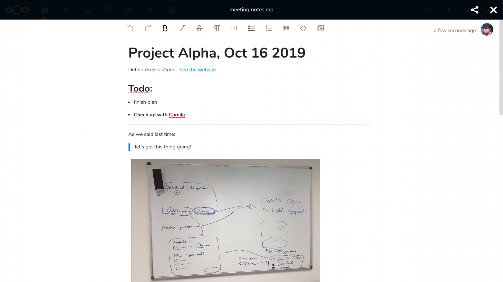

<!--
  - SPDX-FileCopyrightText: 2019-2024 Nextcloud GmbH and Nextcloud contributors
  - SPDX-License-Identifier: AGPL-3.0-or-later
-->
# Nextcloud Text
[](https://api.reuse.software/info/github.com/nextcloud/text)

[](https://github.com/nextcloud/text/issues?q=is%3Aissue+is%3Aopen+sort%3Aupdated-desc+label%3A%22good+first+issue%22)


**📑 Collaborative document editing!**



## Features

- **📝 Simple focused writing:** No distractions, only the formatting you need.
- **🙋 Work together:** Share and collaborate with friends and colleagues, no matter if they use Nextcloud or not!
- **💾 Open format:** Files are saved as [Markdown](https://en.wikipedia.org/wiki/Markdown), so you can edit them from any other text app too.
- **✊ Strong foundation:** We use [🐈 tiptap](https://tiptap.dev) which is based on [🦉 ProseMirror](https://prosemirror.net) – huge thanks to them!

Nextcloud Text is the default text editor since Nextcloud 17. To start editing just open an existing markdown or plaintext file or create a new one.

## Configuration

The rich workspaces in the file list can be disabled either by the users in the files app settings or globally by the admin with the following occ command:

```bash
occ config:app:set text workspace_available --value=0
```


## 🏗 Development setup

This app requires the main branch of the [Viewer app](https://github.com/nextcloud/viewer) to be installed and enabled.
Follow its development setup and then continue here.

1. ☁ Clone this app into the `apps` folder of your Nextcloud: `git clone https://github.com/nextcloud/text.git`
2. 👩‍💻 In the folder of the app, run the command `make` to install dependencies and build the Javascript.
3. ✅ Enable the app through the app management of your Nextcloud
4. 🎉 Partytime! Help fix [some issues](https://github.com/nextcloud/text/issues) and [review pull requests](https://github.com/nextcloud/text/pulls) 👍

### 🧙 Advanced development stuff

To build the Javascript whenever you make changes, instead of the full `make` you can also run `npm run build`. Or run `npm run watch` to rebuild on every file save.

#### 🐞 Testing the app

Currently, this app uses three different kinds of tests:

For testing the backend (PHP) [Psalm](https://psalm.dev/) and [PHPUnit](https://phpunit.de/) are used,
you can run the testcases (placed in `tests/`) using the composer scripts `psalm` and `test:unit`.

For testing the frontend [jest](https://jestjs.io/) is used for unittests, whereas [cypress](https://www.cypress.io/) is used for end2end testing.
The unittests are also placed in `src/tests/`, the cypress tests are placed in `cypress/`.
You can run the tests using the package scripts `npm run test` (jest), and respective `npm run test:cypress` (cypress).

Please note the cypress tests require a nextcloud server running, the if no running server is detected a docker container will be started,
this requires the current user to be in the `docker` group.
Or you might set the `CYPRESS_baseUrl` environment variable for a custom nextcloud server.

#### Adding support for other mime types

- The mime type needs to be known by Nextcloud server (see https://github.com/nextcloud/server/pull/24488 for how this can be added)
- Once that is there, please open a pull request to add them to https://github.com/nextcloud/text/blob/12df66ffdd3d71cc696438e2e4ec60fa17b89a64/src/helpers/mime.js#L35-L61
- You can test them like other mime types in cypress/e2e/files.spec.js


## 🛠️ Integrate text in your app

## Load the editor

In order to load the editor in your app, you'll need to dispatch an event.

```php
use OCA\Text\Event\LoadEditor;

// ...

if (class_exists(LoadEditor::class)) {
	$this->eventDispatcher->dispatchTyped(new LoadEditor());
}
```

### Integrate a file editor

Make sure to check if OCA.Text is available as the Text app needs to be enabled. If you want your app to work without Text being installed, you will need to provide an editor fallback on your own.


```js
window.OCA.Text.createEditor({
	el: document.getElementById('my-editor-div'),
	fileId: 12345,
	filePath: '/Readme.md',
}).then((editor) => {
	// Once ready you can access the editor instance and call methods like:

	editor.setContent('new content') // Beware: this will overwrite the content read from the source file
	editor.setReadOnly(true)
	editor.insertAtCursor('<h1>Heading</h1>')

	// Make sure to destory the editor instance once you remove the dom element
	editor.destroy()
})
```

### Markdown based content editor

```js
window.OCA.Text.createEditor({
	el: document.getElementById('my-editor-div'),
	content: 'initial content',
}).then((editor) => {
	// Once ready you can access the editor instance and call methods like:

	editor.setContent('new content')
	editor.setReadOnly(true)
	editor.insertAtCursor('<h1>Heading</h1>')

	// Make sure to destory the editor instance once you remove the dom element
	editor.destroy()
})
```
