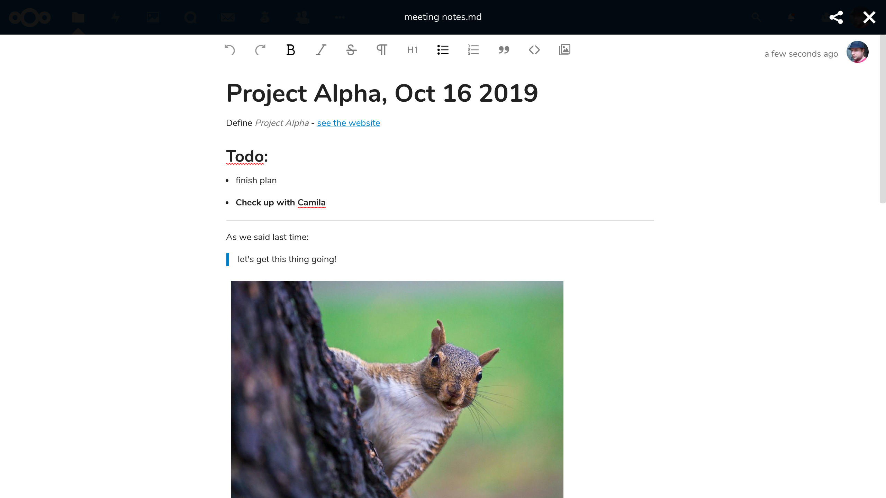

# Nextcloud Text


[](https://github.com/nextcloud/text/issues?q=is%3Aissue+is%3Aopen+sort%3Aupdated-desc+label%3A%22good+first+issue%22)


**📑 Collaborative document editing!**



## Features

- **📝 Simple focused writing:** No distractions, only the formatting you need.
- **🙋 Work together:** Share and collaborate with friends and colleagues, no matter if they use Nextcloud or not!
- **💾 Open format:** Files are saved as [Markdown](https://en.wikipedia.org/wiki/Markdown), so you can edit them from any other text app too.
- **✊ Strong foundation:** We use [🐈 tiptap](https://tiptap.scrumpy.io) which is based on [🦉 ProseMirror](https://prosemirror.net) – huge thanks to them!

Nextcloud Text is the default text editor since Nextcloud 17. To start editing just open an existing markdown or plaintext file or create a new one.

## Configuration

The rich workspaces in the file list can be disabled either by the users in the files app settings or globally by the admin with the following occ command:

```bash
occ config:app:set text workspace_available --value=0
```


## 🏗 Development setup

Currently this app requires the master branch of the [Viewer app](https://github.com/nextcloud/viewer).

1. ☁ Clone this app into the `apps` folder of your Nextcloud: `git clone https://github.com/nextcloud/text.git`
2. 👩‍💻 In the folder of the app, run the command `make` to install dependencies and build the Javascript.
3. ✅ Enable the app through the app management of your Nextcloud
4. 🎉 Partytime! Help fix [some issues](https://github.com/nextcloud/text/issues) and [review pull requests](https://github.com/nextcloud/text/pulls) 👍

### 🧙 Advanced development stuff
To build the Javascript whenever you make changes, instead of the full `make` you can also run `npm run build`. Or run `npm run watch` to rebuild on every file save.

#### 🐞 Testing the app
Currently this app uses three different kinds of tests:

For testing the backend (PHP) [Psalm](https://psalm.dev/) and [PHPUnit](https://phpunit.de/) are used,
you can run the testcases (placed in `tests/`) using the composer scripts `psalm` and `test:unit`.

For testing the frontend [jest](https://jestjs.io/) is used for unittests, whereas [cypress](https://www.cypress.io/) is used for end2end testing.
The unittests are also placed in `tests/`, the cypress tests are placed in `cypress/`.
You can run the tests using the package scripts `npm run test` (jest), and respective `npm run test:cypress` (cypress).

Please note the cypress tests require a nextcloud server running, the if no running server is detected a docker container will be started,
this requires the current user to be in the `docker` group.
Or you might set the `CYPRESS_baseUrl` environment variable for a custom nextcloud server.