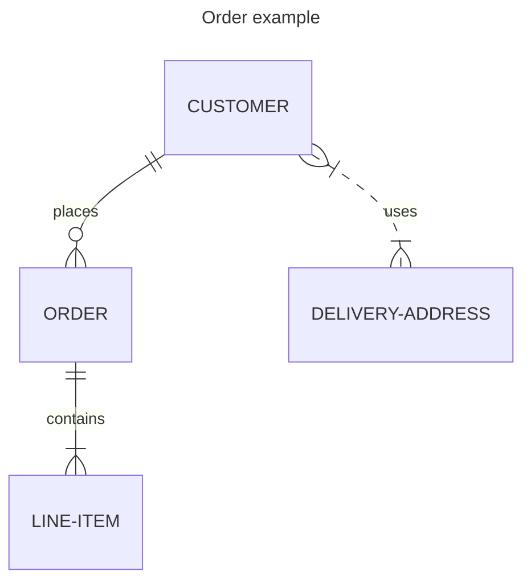

# Some code blocks

## Plain

```
this is a plain text code block
```

## Javascript

```javascript
const foo = "bar";

function add(a, b) {
	return a + b
}

console.log(add(1,2))
```

## Mermaid



## Some more

